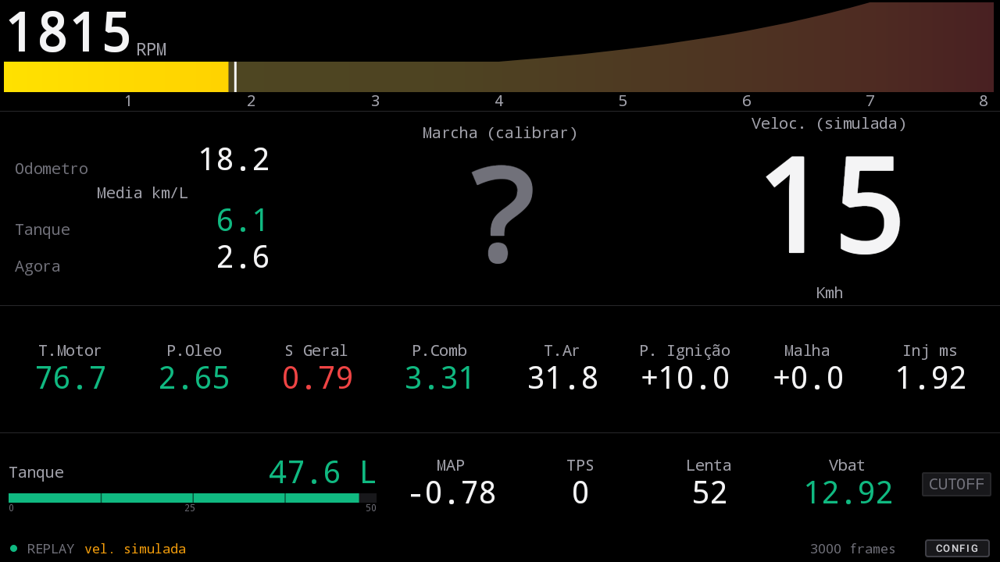

# FT Dash Android

Painel de monitoramento **somente leitura** da FuelTech FT450, para rodar na multimídia Android do carro.

O protocolo veio da engenharia reversa feita em `../ft-tuning-assistant` (Electron/TS): enumeração USB,
handshake, formato do frame e o mapa de offsets dos sensores. **Nada aqui escreve na ECU.**

Duas informações não vêm da FT — a **velocidade** (GPS do próprio Android) e a **marcha** (estimada de
velocidade × RPM, com calibração) — e três são calculadas: **odômetro**, **tanque** e **médias de
consumo**.



## Estado

| Parte | Situação |
|---|---|
| Parser do protocolo | **81 testes passando**, incluindo os 33.699 frames reais no CRC |
| Marcha, odômetro, combustível | cobertos por teste |
| Painel | verificado em 1024×600 e 1280×720 |
| Leitura por USB | **funcionou contra a ECU real** em 06/08/2026 |
| Correções do 1º teste de campo | feitas, **ainda não revalidadas no carro** |

Ver [docs/campo.md](docs/campo.md) para o que o carro respondeu e o que segue em aberto.

## Documentação

| | |
|---|---|
| [arquitetura.md](docs/arquitetura.md) | módulos, fluxo de dados, versões e por que estas |
| [protocolo.md](docs/protocolo.md) | USB da FT450: handshake, frame, offsets, CRC |
| [calculos.md](docs/calculos.md) | marcha, odômetro, combustível, médias, escala de RPM |
| [design-do-painel.md](docs/design-do-painel.md) | decisões visuais e o porquê de cada uma |
| [campo.md](docs/campo.md) | testes no carro, achados e pendências |

## Compilar

Precisa do Android Studio (traz JDK 25, SDK e Gradle).

```bash
./gradlew :core:protocol:test
```

```bash
./gradlew assembleRelease
```

O APK sai em `app/build/outputs/apk/release/` assinado com a chave de debug — é sideload numa
multimídia, nunca vai para a Play Store, e uma chave própria só traria um segredo a mais para guardar.
O que importa é ser instalável e ser build *release*: o `debuggable = false` é o que tira a penalidade
de desempenho que atrapalharia um painel redesenhando a 17 Hz.

Rodando o Gradle pela linha de comando no Windows:

```bash
JAVA_HOME="C:/Program Files/Android/Android Studio/jbr" ./gradlew assembleRelease
```

## Instalar no carro

1. Copie o APK para a central (pendrive ou `adb install`) e permita fontes desconhecidas.
2. Conceda a permissão de **localização** — é o GPS da velocidade. Sem ela o painel funciona, mas sem
   velocidade nem marcha.
3. Cabo **OTG** na porta USB da central + o cabo USB da FT450.
4. O app **não abre sozinho** ao plugar. Marque o FT Dash como app de inicialização nas configurações da
   central. (Um receiver de `BOOT_COMPLETED` não resolveria: desde o Android 10 app em segundo plano não
   pode abrir Activity, falharia em silêncio.)

A fonte padrão é **USB**. Sem FT no barramento, o painel diz o que encontrou e o replay fica a um toque
longo na barra de status.

## Configurar

Botão **CONFIG** no canto da barra de status, ou toque em qualquer mostrador.

| aba | o que faz |
|---|---|
| **APRENDER** | calibra marcha dirigindo: velocidade constante acima de 25 km/h, capture |
| **RELAÇÕES** | calibra marcha por pneu + diferencial + relações da caixa |
| **RPM** | escala da barra: automática (pico registrado) ou manual |
| **TANQUE** | capacidade, vazão do bico (cc/min ou lb/h), nº de bicos; encher e abastecer |
| **USB** | o que a multimídia enxerga no barramento + contadores ao vivo do stream |

Enquanto faltar configuração, os mostradores mostram `--` em vez de inventar número.

## Se o USB não funcionar

A aba **USB** responde qual é o caso:

| mensagem | significado |
|---|---|
| `aparelho não declara USB host` | a porta só serve para pendrive — não há software que resolva |
| `barramento vazio` | cabo OTG errado (só carrega), ou porta sem host de fato |
| device com outro VID:PID | a FT aparece com identificação diferente de `1c5e:1002` |
| `FT450 encontrada, sem permissão` | o mais fácil — é só aceitar o diálogo |

## Desenvolvendo sem o carro

A fonte de **replay** reproduz 3.000 frames reais gravados de uma volta de estrada
(`app/src/main/assets/fixtures/replay-107.txt`), cortados em pacotes de 64 B e passados pelo mesmo
`StreamFramer` do caminho USB — o framer e o re-sync ficam exercitados todo dia, não só no teste.

Como o fixture não tem velocidade (veio da ECU), o `SimulatedSpeedSource` sintetiza km/h a partir do
RPM, com trocas de marcha periódicas. Assim marcha, histerese e calibração são testáveis na mesa.
